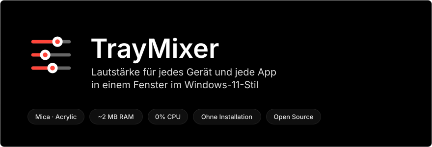
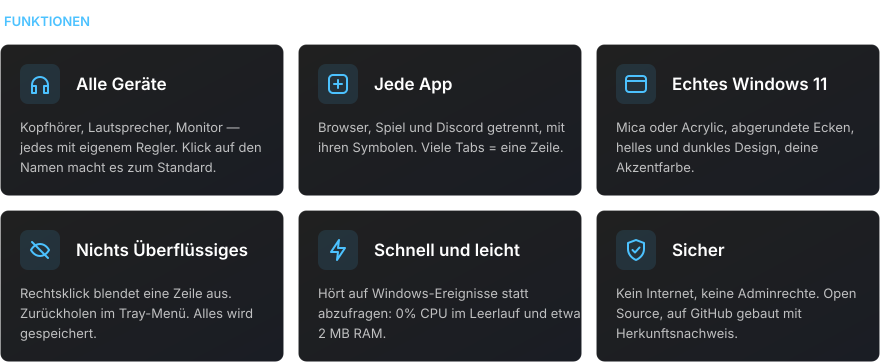
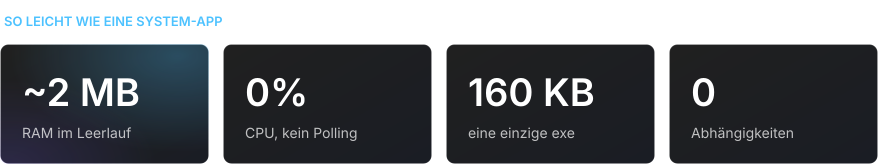
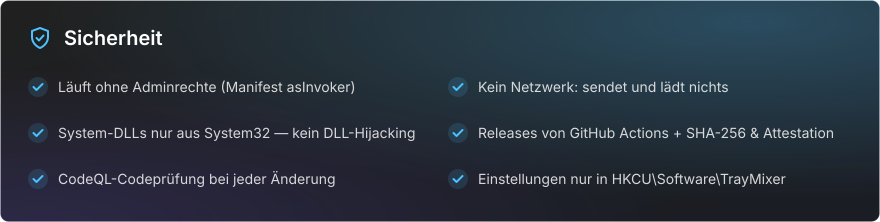

<div align="center">

[Русский](README.md) · [English](README.en.md) · [Español](README.es.md) · [Português](README.pt.md) · **Deutsch** · [Français](README.fr.md) · [Italiano](README.it.md) · [Türkçe](README.tr.md) · [Українська](README.uk.md) · [Polski](README.pl.md)

<br>



<a href="https://github.com/sailxx/TrayMixer/releases/latest/download/TrayMixer.exe"></a>

</div>

<br>


Der Lautstärkemixer von Windows 11 ist in den Einstellungen versteckt, und das Lautstärkesymbol in der Taskleiste steuert nur ein Gerät. **TrayMixer** ist einen Klick entfernt: alle Kopfhörer, Lautsprecher, Monitore und jede App mit eigenem Regler. Ohne Installation, ohne Werbung, ohne Hintergrundlast.

<br>



<details>
<summary><b>Bedienung</b></summary>

| Aktion | Ergebnis |
|---|---|
| **Linksklick** auf das Tray-Symbol | Fenster öffnen oder schließen |
| **Mittelklick** auf das Symbol | Standardgerät stumm schalten oder wieder einschalten |
| **Rechtsklick** auf das Symbol | Soundeinstellungen, Windows-Mixer, ausgeblendete Zeilen, Mica/Acrylic, Autostart, Beenden |
| Klick auf das **Zeilensymbol** | Stumm schalten oder wieder einschalten |
| Klick auf den **Gerätenamen** | Als Standardgerät festlegen |
| **Rechtsklick** auf eine Zeile | Zeile ausblenden |
| **Mausrad** über einer Zeile | Lautstärke oder Helligkeit ±2 |
| **Esc** oder Klick außerhalb | Schließen |

</details>

> [!NOTE]
> Die Oberfläche von TrayMixer ist auf Russisch.

<br>



<br>



<details>
<summary><b>So prüfst du, dass die exe aus diesem Code gebaut wurde</b></summary>

Jedes Release baut GitHub Actions direkt aus dem Quellcode, und GitHub signiert die Herkunft der Datei (Build Provenance):

```bash
gh attestation verify TrayMixer.exe --repo sailxx/TrayMixer
```

Die SHA-256-Prüfsumme liegt in jedem Release neben der exe (`TrayMixer.exe.sha256`):

```powershell
Get-FileHash .\TrayMixer.exe -Algorithm SHA256
```

</details>

## Installation

1. Lade [`TrayMixer.exe`](https://github.com/sailxx/TrayMixer/releases/latest/download/TrayMixer.exe) herunter und lege sie in einen festen Ordner, z. B. `%LOCALAPPDATA%\TrayMixer`.
2. Starte sie. Das Symbol erscheint im Tray, der Autostart schaltet sich selbst ein (abschaltbar im Menü).

Benötigt Windows 10 oder 11 — .NET Framework 4.8 ist bereits im System enthalten. Mica und abgerundete Ecken gibt es unter Windows 11.

> Windows SmartScreen warnt eventuell vor einem unbekannten Herausgeber, weil die Datei nicht mit einem kostenpflichtigen Zertifikat signiert ist. Klicke auf „Weitere Informationen → Trotzdem ausführen“ oder baue das Programm selbst.

## Aus dem Quellcode bauen

```bash
git clone https://github.com/sailxx/TrayMixer.git
```

```bash
TrayMixer\build.cmd
```

Der C#-Compiler ist in Windows bereits enthalten — es muss nichts installiert werden. Die README-Bilder erzeugt `tools\readme-art.cmd` neu.

| Datei | Inhalt |
|---|---|
| `TrayMixer.cs` | Fenster, Darstellung mit Mica, Tray, Einstellungen |
| `Audio.cs` | Windows Core Audio: Geräte, Apps, Benachrichtigungen |
| `Brightness.cs` | Bildschirmhelligkeit: DDC/CI für externe Monitore, WMI für den Laptop-Bildschirm |
| `app.manifest` | Start ohne Adminrechte |
| `tools/` | Generator der README-Bilder |

## Lizenz

[MIT](LICENSE) © sailxx
