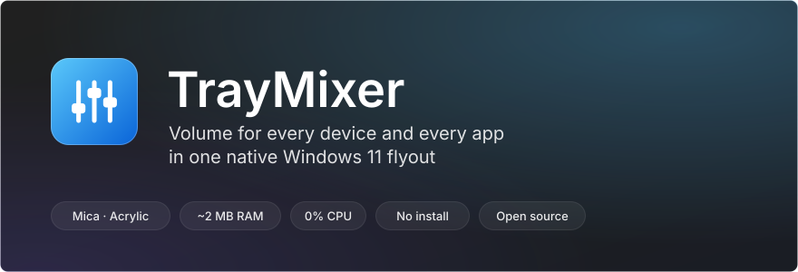
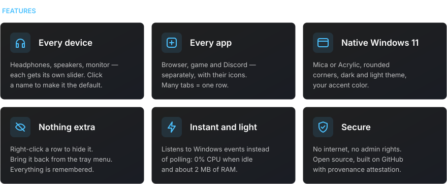
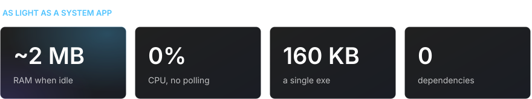
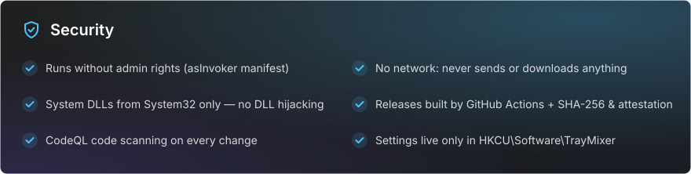

<div align="center">

[Русский](README.md) · **English**

<br>



<a href="https://github.com/sailxx/TrayMixer/releases/latest/download/TrayMixer.exe"></a>

</div>

<br>


The Windows 11 volume mixer is buried in Settings, and the tray volume icon controls just one device. **TrayMixer** is one click away: every pair of headphones, every speaker, every monitor and every app, each with its own slider. No installer, no ads, no background load.

<br>



<details>
<summary><b>Controls</b></summary>

| Action | Result |
|---|---|
| **Left-click** the tray icon | Open or close the flyout |
| **Middle-click** the tray icon | Mute or unmute the default device |
| **Right-click** the tray icon | Sound settings, Windows mixer, hidden rows, Mica/Acrylic, autostart, exit |
| Click a **row icon** | Mute or unmute |
| Click a **device name** | Make it the default device |
| **Right-click** a row | Hide it |
| **Mouse wheel** over a row | Volume or brightness ±2 |
| **Esc** or click outside | Close |

</details>

<br>



<br>



<details>
<summary><b>How to verify the exe was built from this code</b></summary>

Every release is built by GitHub Actions straight from source, and GitHub signs the build provenance:

```bash
gh attestation verify TrayMixer.exe --repo sailxx/TrayMixer
```

A SHA-256 checksum ships next to the exe in every release (`TrayMixer.exe.sha256`):

```powershell
Get-FileHash .\TrayMixer.exe -Algorithm SHA256
```

</details>

## Install

1. Download [`TrayMixer.exe`](https://github.com/sailxx/TrayMixer/releases/latest/download/TrayMixer.exe) and put it in a permanent folder, e.g. `%LOCALAPPDATA%\TrayMixer`.
2. Run it. The icon appears in the tray and autostart turns on by itself (toggle it in the menu).

Requires Windows 10 or 11 — .NET Framework 4.8 is built in. Mica and rounded corners need Windows 11.

> Windows SmartScreen may warn about an unknown publisher because the file isn't signed with a paid certificate. Click "More info → Run anyway", or build it yourself.

## Build from source

```bash
git clone https://github.com/sailxx/TrayMixer.git
```

```bash
TrayMixer\build.cmd
```

The C# compiler ships with Windows — nothing to install. `tools\readme-art.cmd` regenerates the README images.

## License

[MIT](LICENSE) © sailxx
