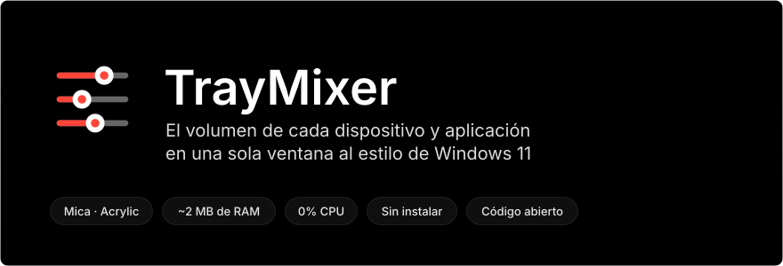
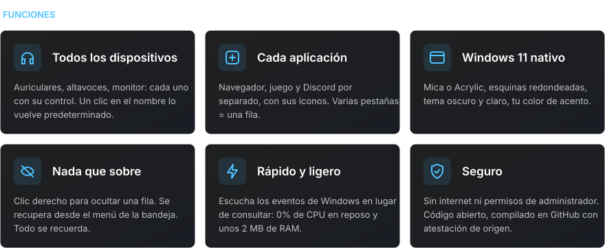
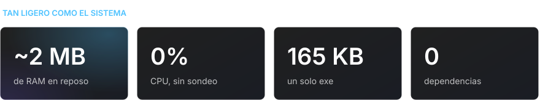
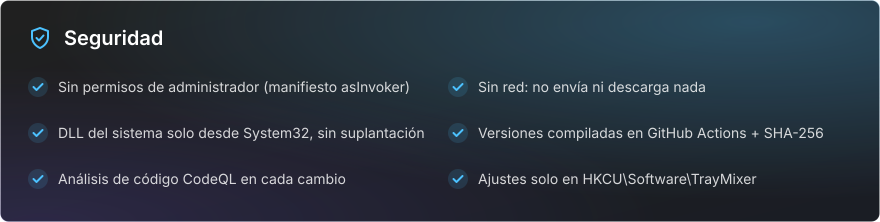

<div align="center">

[Русский](README.md) · [English](README.en.md) · **Español** · [Português](README.pt.md) · [Deutsch](README.de.md) · [Français](README.fr.md) · [Italiano](README.it.md) · [Türkçe](README.tr.md) · [Українська](README.uk.md) · [Polski](README.pl.md)

<br>



<a href="https://github.com/sailxx/TrayMixer/releases/latest/download/TrayMixer.exe"></a>

</div>

<br>


El mezclador de volumen de Windows 11 está escondido en Configuración, y el icono de volumen de la bandeja solo controla un dispositivo. **TrayMixer** está a un clic: todos los auriculares, altavoces, monitores y cada aplicación, cada uno con su propio control. Sin instalación, sin anuncios, sin carga en segundo plano.

<br>



<details>
<summary><b>Controles</b></summary>

| Acción | Resultado |
|---|---|
| **Clic izquierdo** en el icono de la bandeja | Abrir o cerrar la ventana |
| **Clic central** en el icono | Silenciar o activar el sonido del dispositivo predeterminado |
| **Clic derecho** en el icono | Configuración de sonido, mezclador de Windows, filas ocultas, Mica/Acrylic, inicio automático, salir |
| Clic en el **icono de una fila** | Silenciar o activar el sonido |
| Clic en el **nombre del dispositivo** | Convertirlo en predeterminado |
| **Clic derecho** en una fila | Ocultarla |
| **Rueda del ratón** sobre una fila | Volumen o brillo ±2 |
| **Esc** o clic fuera de la ventana | Cerrar |

</details>

> [!NOTE]
> La interfaz de TrayMixer está en ruso.

<br>



<br>



<details>
<summary><b>Cómo comprobar que el exe se compiló a partir de este código</b></summary>

Cada versión la compila GitHub Actions directamente desde el código fuente, y GitHub firma el origen del archivo (build provenance):

```bash
gh attestation verify TrayMixer.exe --repo sailxx/TrayMixer
```

La suma de comprobación SHA-256 se publica junto al exe en cada versión (`TrayMixer.exe.sha256`):

```powershell
Get-FileHash .\TrayMixer.exe -Algorithm SHA256
```

</details>

## Instalación

1. Descarga [`TrayMixer.exe`](https://github.com/sailxx/TrayMixer/releases/latest/download/TrayMixer.exe) y guárdalo en una carpeta permanente, por ejemplo `%LOCALAPPDATA%\TrayMixer`.
2. Ejecútalo. El icono aparecerá en la bandeja y el inicio automático se activará solo (se desactiva en el menú).

Requiere Windows 10 u 11: .NET Framework 4.8 ya viene con el sistema. Mica y las esquinas redondeadas necesitan Windows 11.

> Windows SmartScreen puede advertir de un editor desconocido porque el archivo no está firmado con un certificado de pago. Pulsa «Más información → Ejecutar de todas formas» o compila el programa tú mismo.

## Compilar desde el código fuente

```bash
git clone https://github.com/sailxx/TrayMixer.git
```

```bash
TrayMixer\build.cmd
```

El compilador de C# ya viene con Windows: no hay que instalar nada. Las imágenes del README se regeneran con `tools\readme-art.cmd`.

| Archivo | Contenido |
|---|---|
| `TrayMixer.cs` | Ventana, dibujo con Mica, bandeja, ajustes |
| `Audio.cs` | Windows Core Audio: dispositivos, aplicaciones, notificaciones |
| `Brightness.cs` | Brillo de pantalla: DDC/CI para monitores externos, WMI para la pantalla del portátil |
| `app.manifest` | Ejecución sin permisos de administrador |
| `tools/` | Generador de imágenes del README |

## Licencia

[MIT](LICENSE) © sailxx
