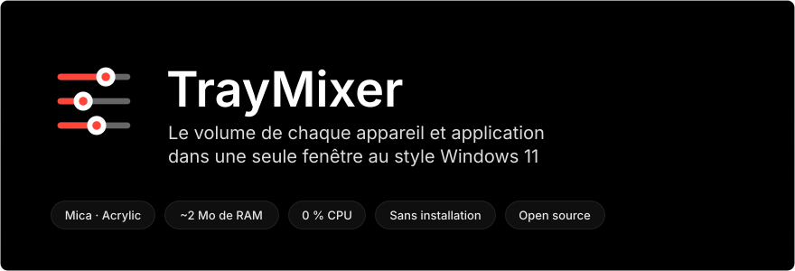
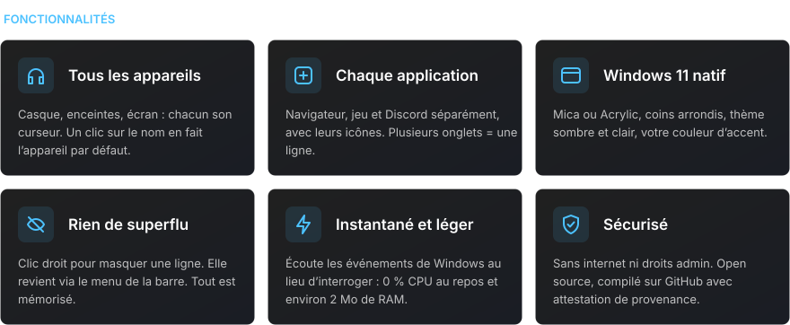
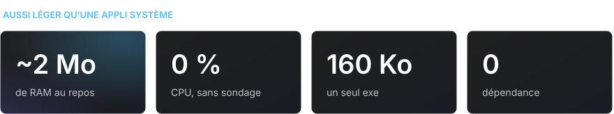
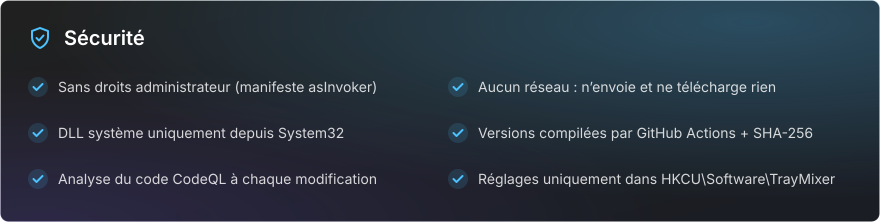

<div align="center">

[Русский](README.md) · [English](README.en.md) · [Español](README.es.md) · [Português](README.pt.md) · [Deutsch](README.de.md) · **Français** · [Italiano](README.it.md) · [Türkçe](README.tr.md) · [Українська](README.uk.md) · [Polski](README.pl.md)

<br>



<a href="https://github.com/sailxx/TrayMixer/releases/latest/download/TrayMixer.exe"></a>

</div>

<br>


Le mélangeur de volume de Windows 11 est caché dans les Paramètres, et l’icône de volume de la barre des tâches ne règle qu’un seul appareil. **TrayMixer** est à un clic : tous les casques, enceintes, écrans et chaque application, chacun avec son propre curseur. Sans installation, sans publicité, sans charge en arrière-plan.

<br>



<details>
<summary><b>Commandes</b></summary>

| Action | Résultat |
|---|---|
| **Clic gauche** sur l’icône de la barre | Ouvrir ou fermer la fenêtre |
| **Clic du milieu** sur l’icône | Couper ou rétablir le son de l’appareil par défaut |
| **Clic droit** sur l’icône | Paramètres audio, mélangeur Windows, lignes masquées, Mica/Acrylic, démarrage automatique, quitter |
| Clic sur l’**icône d’une ligne** | Couper ou rétablir le son |
| Clic sur le **nom de l’appareil** | En faire l’appareil par défaut |
| **Clic droit** sur une ligne | La masquer |
| **Molette** au-dessus d’une ligne | Volume ou luminosité ±2 |
| **Échap** ou clic en dehors | Fermer |

</details>

> [!NOTE]
> L’interface de TrayMixer est en russe.

<br>



<br>



<details>
<summary><b>Comment vérifier que l’exe a été compilé à partir de ce code</b></summary>

Chaque version est compilée par GitHub Actions directement depuis le code source, et GitHub signe la provenance du fichier (build provenance) :

```bash
gh attestation verify TrayMixer.exe --repo sailxx/TrayMixer
```

La somme de contrôle SHA-256 accompagne l’exe dans chaque version (`TrayMixer.exe.sha256`) :

```powershell
Get-FileHash .\TrayMixer.exe -Algorithm SHA256
```

</details>

## Installation

1. Téléchargez [`TrayMixer.exe`](https://github.com/sailxx/TrayMixer/releases/latest/download/TrayMixer.exe) et placez-le dans un dossier permanent, par exemple `%LOCALAPPDATA%\TrayMixer`.
2. Lancez-le. L’icône apparaît dans la barre des tâches et le démarrage automatique s’active tout seul (il se désactive dans le menu).

Nécessite Windows 10 ou 11 — .NET Framework 4.8 est déjà intégré au système. Mica et les coins arrondis nécessitent Windows 11.

> Windows SmartScreen peut signaler un éditeur inconnu, car le fichier n’est pas signé avec un certificat payant. Cliquez sur « Informations complémentaires → Exécuter quand même » ou compilez le programme vous-même.

## Compiler depuis les sources

```bash
git clone https://github.com/sailxx/TrayMixer.git
```

```bash
TrayMixer\build.cmd
```

Le compilateur C# est déjà fourni avec Windows — rien à installer. Les images du README sont régénérées par `tools\readme-art.cmd`.

| Fichier | Contenu |
|---|---|
| `TrayMixer.cs` | Fenêtre, rendu avec Mica, barre des tâches, réglages |
| `Audio.cs` | Windows Core Audio : appareils, applications, notifications |
| `Brightness.cs` | Luminosité de l’écran : DDC/CI pour les écrans externes, WMI pour l’écran du portable |
| `app.manifest` | Lancement sans droits administrateur |
| `tools/` | Générateur des images du README |

## Licence

[MIT](LICENSE) © sailxx
