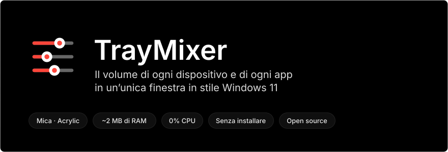
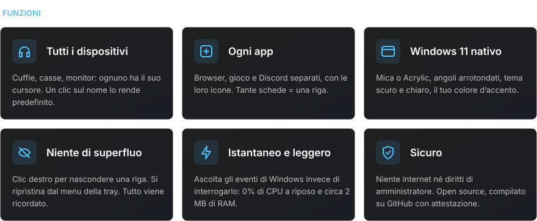
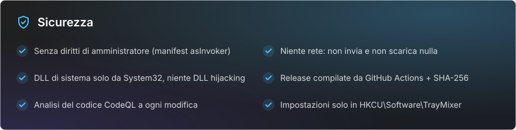

<div align="center">

[Русский](README.md) · [English](README.en.md) · [Español](README.es.md) · [Português](README.pt.md) · [Deutsch](README.de.md) · [Français](README.fr.md) · **Italiano** · [Türkçe](README.tr.md) · [Українська](README.uk.md) · [Polski](README.pl.md)

<br>



<a href="https://github.com/sailxx/TrayMixer/releases/latest/download/TrayMixer.exe"></a>

</div>

<br>


Il mixer del volume di Windows 11 è nascosto nelle Impostazioni, e l’icona del volume nella tray regola un solo dispositivo. **TrayMixer** è a un clic di distanza: tutte le cuffie, le casse, i monitor e ogni app, ciascuno con il proprio cursore. Senza installazione, senza pubblicità, senza carico in background.

<br>



<details>
<summary><b>Comandi</b></summary>

| Azione | Risultato |
|---|---|
| **Clic sinistro** sull’icona nella tray | Aprire o chiudere la finestra |
| **Clic centrale** sull’icona | Disattivare o riattivare l’audio del dispositivo predefinito |
| **Clic destro** sull’icona | Impostazioni audio, mixer di Windows, righe nascoste, Mica/Acrylic, avvio automatico, esci |
| Clic sull’**icona di una riga** | Disattivare o riattivare l’audio |
| Clic sul **nome del dispositivo** | Renderlo predefinito |
| **Clic destro** su una riga | Nasconderla |
| **Rotella del mouse** su una riga | Volume o luminosità ±2 |
| **Esc** o clic fuori dalla finestra | Chiudere |

</details>

> [!NOTE]
> L’interfaccia di TrayMixer è in russo.

<br>


<br>



<details>
<summary><b>Come verificare che l’exe sia stato compilato da questo codice</b></summary>

Ogni release viene compilata da GitHub Actions direttamente dai sorgenti, e GitHub firma la provenienza del file (build provenance):

```bash
gh attestation verify TrayMixer.exe --repo sailxx/TrayMixer
```

Il checksum SHA-256 si trova accanto all’exe in ogni release (`TrayMixer.exe.sha256`):

```powershell
Get-FileHash .\TrayMixer.exe -Algorithm SHA256
```

</details>

## Installazione

1. Scarica [`TrayMixer.exe`](https://github.com/sailxx/TrayMixer/releases/latest/download/TrayMixer.exe) e mettilo in una cartella permanente, ad esempio `%LOCALAPPDATA%\TrayMixer`.
2. Avvialo. L’icona compare nella tray e l’avvio automatico si attiva da solo (si disattiva dal menu).

Serve Windows 10 o 11: .NET Framework 4.8 è già incluso nel sistema. Mica e gli angoli arrotondati richiedono Windows 11.

> Windows SmartScreen potrebbe avvisare di un editore sconosciuto, perché il file non è firmato con un certificato a pagamento. Fai clic su «Ulteriori informazioni → Esegui comunque» oppure compila il programma da solo.

## Compilare dai sorgenti

```bash
git clone https://github.com/sailxx/TrayMixer.git
```

```bash
TrayMixer\build.cmd
```

Il compilatore C# è già incluso in Windows: non serve installare nulla. Le immagini del README si rigenerano con `tools\readme-art.cmd`.

| File | Contenuto |
|---|---|
| `TrayMixer.cs` | Finestra, disegno con Mica, tray, impostazioni |
| `Audio.cs` | Windows Core Audio: dispositivi, app, notifiche |
| `Brightness.cs` | Luminosità dello schermo: DDC/CI per i monitor esterni, WMI per lo schermo del portatile |
| `app.manifest` | Avvio senza diritti di amministratore |
| `tools/` | Generatore delle immagini del README |

## Licenza

[MIT](LICENSE) © sailxx
