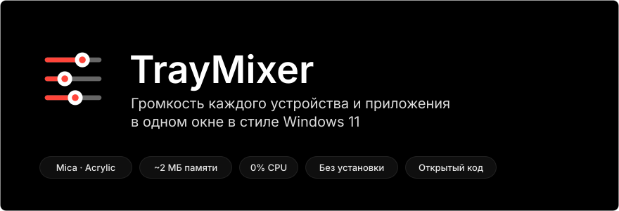
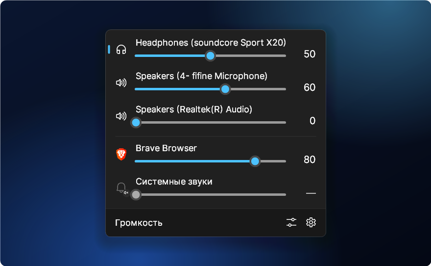
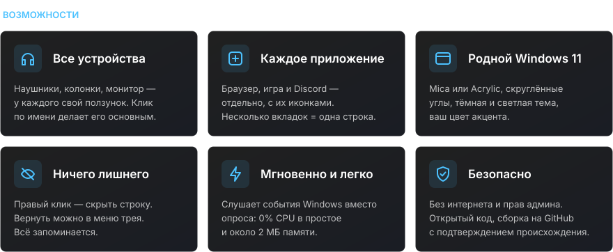
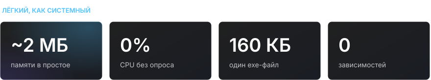
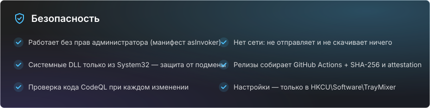

<div align="center">

**Русский** · [English](README.en.md)

<br>



<a href="https://github.com/sailxx/TrayMixer/releases/latest/download/TrayMixer.exe"></a>

</div>

<br>



Стандартный микшер Windows 11 спрятан в «Параметрах», а значок громкости в трее меняет только одно устройство. **TrayMixer** — один клик по значку, и перед вами все наушники, колонки, мониторы и каждое приложение со своим ползунком. Без установки, без рекламы, без фоновой нагрузки.

<br>



<details>
<summary><b>Управление</b></summary>

| Действие | Результат |
|---|---|
| **Левый клик** по значку в трее | Открыть или закрыть окно |
| **Средний клик** по значку | Выключить или включить звук основного устройства |
| **Правый клик** по значку | Параметры звука, микшер Windows, скрытые строки, фон Mica/Acrylic, автозапуск, выход |
| Клик по **иконке строки** | Выключить или включить звук |
| Клик по **названию устройства** | Сделать его основным |
| **Правый клик** по строке | Скрыть её |
| **Колёсико мыши** над строкой | Громкость ±2 |
| **Esc** или клик мимо окна | Закрыть |

</details>

<br>



<br>



<details>
<summary><b>Как проверить, что exe собран из этого кода</b></summary>

Каждый релиз собирает GitHub Actions прямо из исходников, а GitHub подписывает происхождение файла (build provenance). Проверить можно так:

```bash
gh attestation verify TrayMixer.exe --repo sailxx/TrayMixer
```

Контрольная сумма SHA-256 лежит рядом с exe в каждом релизе (`TrayMixer.exe.sha256`):

```powershell
Get-FileHash .\TrayMixer.exe -Algorithm SHA256
```

</details>

## Установка

1. Скачайте [`TrayMixer.exe`](https://github.com/sailxx/TrayMixer/releases/latest/download/TrayMixer.exe) и положите в постоянную папку, например `%LOCALAPPDATA%\TrayMixer`.
2. Запустите. Значок появится в трее, автозапуск включится сам (выключается в меню).

Нужна Windows 10 или 11 — .NET Framework 4.8 уже встроен в систему. Mica и скруглённые углы — в Windows 11.

> Windows SmartScreen может предупредить о неизвестном издателе: файл не подписан платным сертификатом. Нажмите «Подробнее → Выполнить в любом случае» или соберите программу сами.

## Сборка из исходников

```bash
git clone https://github.com/sailxx/TrayMixer.git
```

```bash
TrayMixer\build.cmd
```

Компилятор C# уже есть в Windows — ничего устанавливать не нужно. Картинки для README пересобирает `tools\readme-art.cmd`.

| Файл | Что внутри |
|---|---|
| `TrayMixer.cs` | Окно, отрисовка с Mica, трей, настройки |
| `Audio.cs` | Windows Core Audio: устройства, приложения, уведомления |
| `app.manifest` | Запуск без прав администратора |
| `tools/` | Генератор картинок README |

## Лицензия

[MIT](LICENSE) © sailxx
