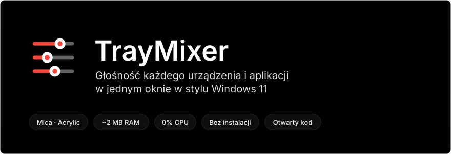
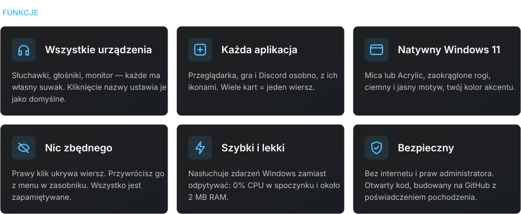
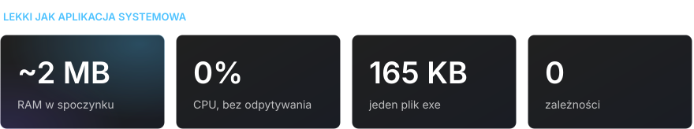
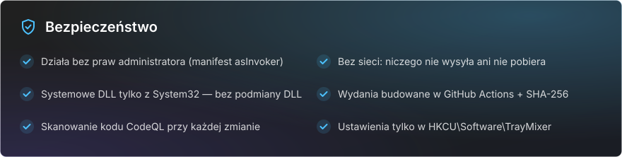

<div align="center">

[Русский](README.md) · [English](README.en.md) · [Español](README.es.md) · [Português](README.pt.md) · [Deutsch](README.de.md) · [Français](README.fr.md) · [Italiano](README.it.md) · [Türkçe](README.tr.md) · [Українська](README.uk.md) · **Polski**

<br>



<a href="https://github.com/sailxx/TrayMixer/releases/latest/download/TrayMixer.exe"></a>

</div>

<br>


Mikser głośności Windows 11 jest schowany w Ustawieniach, a ikona głośności w zasobniku steruje tylko jednym urządzeniem. **TrayMixer** jest na jedno kliknięcie: wszystkie słuchawki, głośniki, monitory i każda aplikacja, każde z własnym suwakiem. Bez instalacji, bez reklam, bez obciążenia w tle.

<br>



<details>
<summary><b>Sterowanie</b></summary>

| Akcja | Wynik |
|---|---|
| **Lewy klik** ikony w zasobniku | Otwarcie lub zamknięcie okna |
| **Środkowy klik** ikony | Wyciszenie lub włączenie dźwięku urządzenia domyślnego |
| **Prawy klik** ikony | Ustawienia dźwięku, mikser Windows, ukryte wiersze, Mica/Acrylic, autostart, wyjście |
| Klik **ikony wiersza** | Wyciszenie lub włączenie dźwięku |
| Klik **nazwy urządzenia** | Ustawienie go jako domyślnego |
| **Prawy klik** wiersza | Ukrycie go |
| **Kółko myszy** nad wierszem | Głośność lub jasność ±2 |
| **Esc** lub klik poza oknem | Zamknięcie |

</details>

> [!NOTE]
> Interfejs TrayMixer jest po rosyjsku.

<br>



<br>



<details>
<summary><b>Jak sprawdzić, że exe zbudowano z tego kodu</b></summary>

Każde wydanie buduje GitHub Actions prosto z kodu źródłowego, a GitHub podpisuje pochodzenie pliku (build provenance):

```bash
gh attestation verify TrayMixer.exe --repo sailxx/TrayMixer
```

Suma kontrolna SHA-256 jest dołączona do exe w każdym wydaniu (`TrayMixer.exe.sha256`):

```powershell
Get-FileHash .\TrayMixer.exe -Algorithm SHA256
```

</details>

## Instalacja

1. Pobierz [`TrayMixer.exe`](https://github.com/sailxx/TrayMixer/releases/latest/download/TrayMixer.exe) i umieść go w stałym folderze, np. `%LOCALAPPDATA%\TrayMixer`.
2. Uruchom go. Ikona pojawi się w zasobniku, a autostart włączy się sam (można go wyłączyć w menu).

Wymaga Windows 10 lub 11 — .NET Framework 4.8 jest już wbudowany w system. Mica i zaokrąglone rogi działają w Windows 11.

> Windows SmartScreen może ostrzec o nieznanym wydawcy, bo plik nie jest podpisany płatnym certyfikatem. Kliknij „Więcej informacji → Uruchom mimo to” albo zbuduj program samodzielnie.

## Budowanie ze źródeł

```bash
git clone https://github.com/sailxx/TrayMixer.git
```

```bash
TrayMixer\build.cmd
```

Kompilator C# jest już w Windows — nic nie trzeba instalować. Obrazki README generuje na nowo `tools\readme-art.cmd`.

| Plik | Zawartość |
|---|---|
| `TrayMixer.cs` | Okno, rysowanie z Mica, zasobnik, ustawienia |
| `Audio.cs` | Windows Core Audio: urządzenia, aplikacje, powiadomienia |
| `Brightness.cs` | Jasność ekranów: DDC/CI dla monitorów zewnętrznych, WMI dla ekranu laptopa |
| `app.manifest` | Uruchamianie bez praw administratora |
| `tools/` | Generator obrazków README |

## Licencja

[MIT](LICENSE) © sailxx
