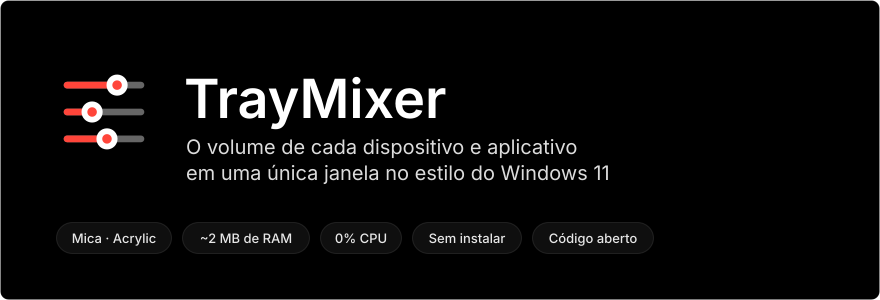
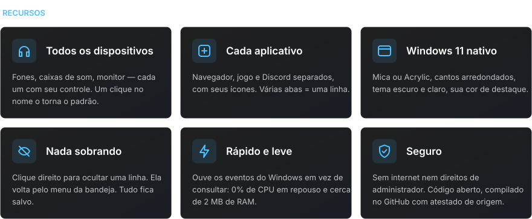
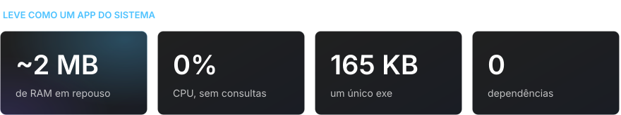
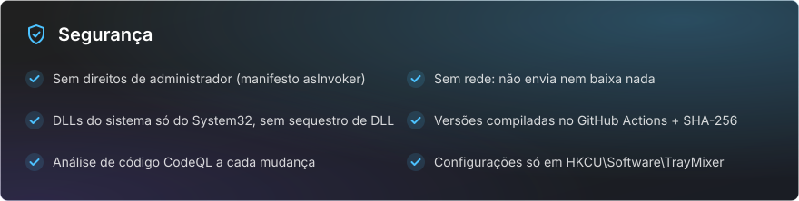

<div align="center">

[Русский](README.md) · [English](README.en.md) · [Español](README.es.md) · **Português** · [Deutsch](README.de.md) · [Français](README.fr.md) · [Italiano](README.it.md) · [Türkçe](README.tr.md) · [Українська](README.uk.md) · [Polski](README.pl.md)

<br>



<a href="https://github.com/sailxx/TrayMixer/releases/latest/download/TrayMixer.exe"></a>

</div>

<br>


O mixer de volume do Windows 11 fica escondido nas Configurações, e o ícone de volume da bandeja controla só um dispositivo. O **TrayMixer** está a um clique: todos os fones, caixas de som, monitores e cada aplicativo, cada um com seu próprio controle. Sem instalação, sem anúncios, sem carga em segundo plano.

<br>



<details>
<summary><b>Controles</b></summary>

| Ação | Resultado |
|---|---|
| **Clique esquerdo** no ícone da bandeja | Abrir ou fechar a janela |
| **Clique do meio** no ícone | Silenciar ou reativar o dispositivo padrão |
| **Clique direito** no ícone | Configurações de som, mixer do Windows, linhas ocultas, Mica/Acrylic, inicialização automática, sair |
| Clique no **ícone da linha** | Silenciar ou reativar o som |
| Clique no **nome do dispositivo** | Torná-lo o padrão |
| **Clique direito** em uma linha | Ocultá-la |
| **Roda do mouse** sobre uma linha | Volume ou brilho ±2 |
| **Esc** ou clique fora da janela | Fechar |

</details>

> [!NOTE]
> A interface do TrayMixer está em russo.

<br>



<br>



<details>
<summary><b>Como verificar que o exe foi compilado a partir deste código</b></summary>

Cada versão é compilada pelo GitHub Actions direto do código-fonte, e o GitHub assina a origem do arquivo (build provenance):

```bash
gh attestation verify TrayMixer.exe --repo sailxx/TrayMixer
```

O checksum SHA-256 acompanha o exe em cada versão (`TrayMixer.exe.sha256`):

```powershell
Get-FileHash .\TrayMixer.exe -Algorithm SHA256
```

</details>

## Instalação

1. Baixe o [`TrayMixer.exe`](https://github.com/sailxx/TrayMixer/releases/latest/download/TrayMixer.exe) e coloque-o em uma pasta permanente, por exemplo `%LOCALAPPDATA%\TrayMixer`.
2. Execute-o. O ícone aparece na bandeja e a inicialização automática é ativada sozinha (dá para desligar no menu).

Requer Windows 10 ou 11 — o .NET Framework 4.8 já vem no sistema. Mica e cantos arredondados precisam do Windows 11.

> O Windows SmartScreen pode avisar sobre um editor desconhecido, porque o arquivo não é assinado com um certificado pago. Clique em "Mais informações → Executar assim mesmo" ou compile o programa você mesmo.

## Compilar a partir do código-fonte

```bash
git clone https://github.com/sailxx/TrayMixer.git
```

```bash
TrayMixer\build.cmd
```

O compilador de C# já vem com o Windows — não é preciso instalar nada. As imagens do README são geradas de novo por `tools\readme-art.cmd`.

| Arquivo | Conteúdo |
|---|---|
| `TrayMixer.cs` | Janela, desenho com Mica, bandeja, configurações |
| `Audio.cs` | Windows Core Audio: dispositivos, aplicativos, notificações |
| `Brightness.cs` | Brilho da tela: DDC/CI para monitores externos, WMI para a tela do notebook |
| `app.manifest` | Execução sem direitos de administrador |
| `tools/` | Gerador das imagens do README |

## Licença

[MIT](LICENSE) © sailxx
