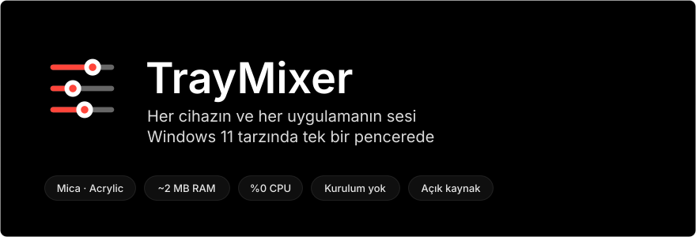
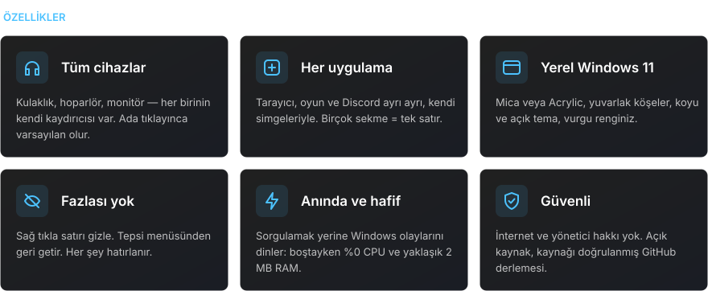
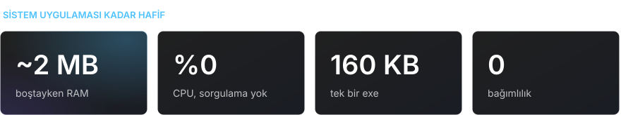
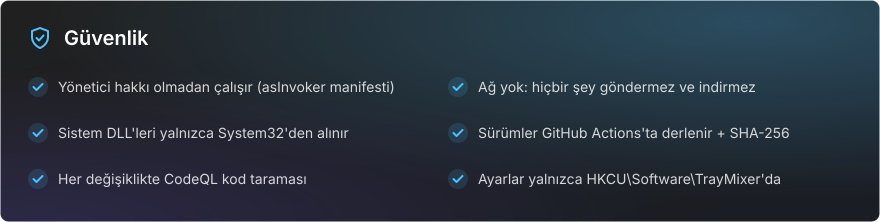

<div align="center">

[Русский](README.md) · [English](README.en.md) · [Español](README.es.md) · [Português](README.pt.md) · [Deutsch](README.de.md) · [Français](README.fr.md) · [Italiano](README.it.md) · **Türkçe** · [Українська](README.uk.md) · [Polski](README.pl.md)

<br>



<a href="https://github.com/sailxx/TrayMixer/releases/latest/download/TrayMixer.exe"></a>

</div>

<br>


Windows 11'in ses karıştırıcısı Ayarlar'ın içinde saklı, tepsideki ses simgesi ise yalnızca tek bir cihazı kontrol ediyor. **TrayMixer** bir tık uzağınızda: tüm kulaklıklar, hoparlörler, monitörler ve her uygulama, her biri kendi kaydırıcısıyla. Kurulum yok, reklam yok, arka plan yükü yok.

<br>



<details>
<summary><b>Kontroller</b></summary>

| Eylem | Sonuç |
|---|---|
| Tepsi simgesine **sol tık** | Pencereyi aç veya kapat |
| Simgeye **orta tık** | Varsayılan cihazın sesini kapat veya aç |
| Simgeye **sağ tık** | Ses ayarları, Windows karıştırıcısı, gizli satırlar, Mica/Acrylic, otomatik başlatma, çıkış |
| **Satır simgesine** tık | Sesi kapat veya aç |
| **Cihaz adına** tık | Varsayılan cihaz yap |
| Satıra **sağ tık** | Satırı gizle |
| Satırın üzerinde **fare tekerleği** | Ses veya parlaklık ±2 |
| **Esc** veya pencere dışına tık | Kapat |

</details>

> [!NOTE]
> TrayMixer'ın arayüzü Rusçadır.

<br>



<br>



<details>
<summary><b>exe'nin bu koddan derlendiği nasıl doğrulanır</b></summary>

Her sürümü GitHub Actions doğrudan kaynak koddan derler ve GitHub dosyanın kaynağını imzalar (build provenance):

```bash
gh attestation verify TrayMixer.exe --repo sailxx/TrayMixer
```

SHA-256 sağlama toplamı her sürümde exe'nin yanında bulunur (`TrayMixer.exe.sha256`):

```powershell
Get-FileHash .\TrayMixer.exe -Algorithm SHA256
```

</details>

## Kurulum

1. [`TrayMixer.exe`](https://github.com/sailxx/TrayMixer/releases/latest/download/TrayMixer.exe) dosyasını indirin ve kalıcı bir klasöre koyun, örneğin `%LOCALAPPDATA%\TrayMixer`.
2. Çalıştırın. Simge tepside görünür ve otomatik başlatma kendiliğinden açılır (menüden kapatılabilir).

Windows 10 veya 11 gerekir — .NET Framework 4.8 sistemde zaten var. Mica ve yuvarlak köşeler Windows 11'de çalışır.

> Windows SmartScreen bilinmeyen yayıncı uyarısı verebilir, çünkü dosya ücretli bir sertifikayla imzalanmamıştır. "Ek bilgi → Yine de çalıştır"a tıklayın ya da programı kendiniz derleyin.

## Kaynak koddan derleme

```bash
git clone https://github.com/sailxx/TrayMixer.git
```

```bash
TrayMixer\build.cmd
```

C# derleyicisi Windows'ta zaten var — hiçbir şey kurmanız gerekmez. README görsellerini `tools\readme-art.cmd` yeniden oluşturur.

| Dosya | İçerik |
|---|---|
| `TrayMixer.cs` | Pencere, Mica ile çizim, tepsi, ayarlar |
| `Audio.cs` | Windows Core Audio: cihazlar, uygulamalar, bildirimler |
| `Brightness.cs` | Ekran parlaklığı: harici monitörler için DDC/CI, dizüstü ekranı için WMI |
| `app.manifest` | Yönetici hakkı olmadan çalıştırma |
| `tools/` | README görsel oluşturucusu |

## Lisans

[MIT](LICENSE) © sailxx
