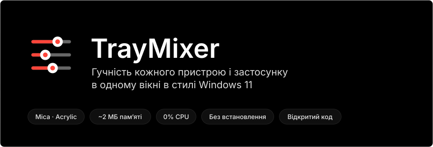
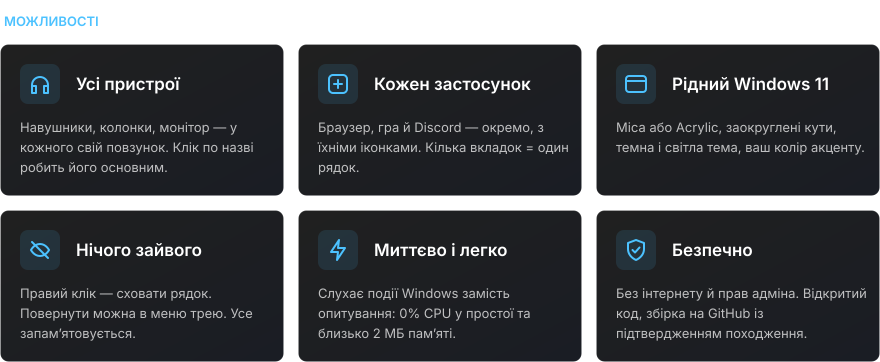
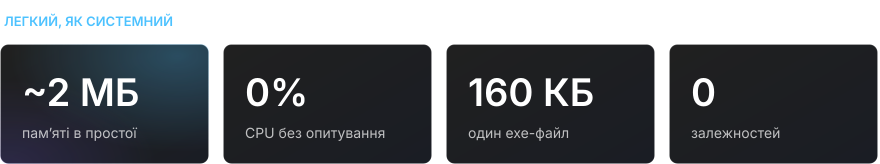
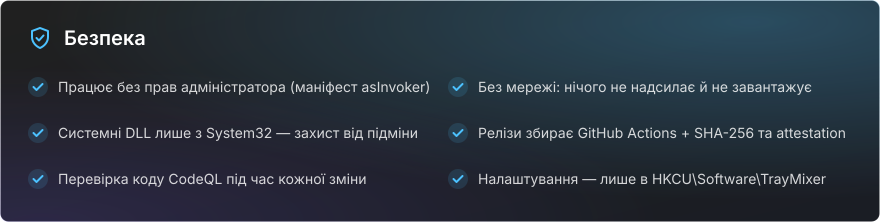

<div align="center">

[Русский](README.md) · [English](README.en.md) · [Español](README.es.md) · [Português](README.pt.md) · [Deutsch](README.de.md) · [Français](README.fr.md) · [Italiano](README.it.md) · [Türkçe](README.tr.md) · **Українська** · [Polski](README.pl.md)

<br>



<a href="https://github.com/sailxx/TrayMixer/releases/latest/download/TrayMixer.exe"></a>

</div>

<br>


Стандартний мікшер Windows 11 захований у «Параметрах», а значок гучності в треї змінює лише один пристрій. **TrayMixer** — один клік по значку, і перед вами всі навушники, колонки, монітори та кожен застосунок зі своїм повзунком. Без встановлення, без реклами, без фонового навантаження.

<br>



<details>
<summary><b>Керування</b></summary>

| Дія | Результат |
|---|---|
| **Лівий клік** по значку в треї | Відкрити або закрити вікно |
| **Середній клік** по значку | Вимкнути або ввімкнути звук основного пристрою |
| **Правий клік** по значку | Параметри звуку, мікшер Windows, приховані рядки, фон Mica/Acrylic, автозапуск, вихід |
| Клік по **іконці рядка** | Вимкнути або ввімкнути звук |
| Клік по **назві пристрою** | Зробити його основним |
| **Правий клік** по рядку | Приховати його |
| **Коліщатко миші** над рядком | Гучність або яскравість ±2 |
| **Esc** або клік повз вікно | Закрити |

</details>

> [!NOTE]
> Інтерфейс TrayMixer — російською мовою.

<br>



<br>



<details>
<summary><b>Як перевірити, що exe зібрано з цього коду</b></summary>

Кожен реліз збирає GitHub Actions просто з вихідного коду, а GitHub підписує походження файлу (build provenance). Перевірити можна так:

```bash
gh attestation verify TrayMixer.exe --repo sailxx/TrayMixer
```

Контрольна сума SHA-256 лежить поруч з exe у кожному релізі (`TrayMixer.exe.sha256`):

```powershell
Get-FileHash .\TrayMixer.exe -Algorithm SHA256
```

</details>

## Встановлення

1. Завантажте [`TrayMixer.exe`](https://github.com/sailxx/TrayMixer/releases/latest/download/TrayMixer.exe) і покладіть у постійну папку, наприклад `%LOCALAPPDATA%\TrayMixer`.
2. Запустіть. Значок з’явиться в треї, автозапуск увімкнеться сам (вимикається в меню).

Потрібна Windows 10 або 11 — .NET Framework 4.8 уже вбудований у систему. Mica й заокруглені кути — у Windows 11.

> Windows SmartScreen може попередити про невідомого видавця: файл не підписано платним сертифікатом. Натисніть «Докладніше → Усе одно запустити» або зберіть програму самі.

## Збірка з вихідного коду

```bash
git clone https://github.com/sailxx/TrayMixer.git
```

```bash
TrayMixer\build.cmd
```

Компілятор C# уже є у Windows — нічого встановлювати не потрібно. Картинки для README перезбирає `tools\readme-art.cmd`.

| Файл | Що всередині |
|---|---|
| `TrayMixer.cs` | Вікно, малювання з Mica, трей, налаштування |
| `Audio.cs` | Windows Core Audio: пристрої, застосунки, сповіщення |
| `Brightness.cs` | Яскравість екранів: DDC/CI для зовнішніх моніторів, WMI для екрана ноутбука |
| `app.manifest` | Запуск без прав адміністратора |
| `tools/` | Генератор картинок README |

## Ліцензія

[MIT](LICENSE) © sailxx
